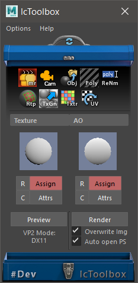

# LCT Tools - Legacy

## Description
This repository is for historical reference and the source code may not be functional in current versions of Maya. Some functionality relies on web services that are no longer active, so auto-updating and error reporting features do not work.

This is a suite of Maya artist tools developed between 2013 and 2017.  It was targeted at Maya 2016 but should be compatible with other versions.

See the [Releases](/releases/latest) page for pre-built packages.

#### Notes of Interest
* The tools were designed to be artist friendly. They installed with one command by adding a shelf icon to the current shelf.
* Tools had a unified UI window with contextual menus.
    * They could load in the shared window as needed, and remember their settings.
    * They could be popped-out to free floating windows.
* Tools had auto updating functionality.
    * They would query a web server to check for the latest version.
    * They would automatically download, unpack and update the new files.
* Tools could post automated error logs to a web server so that I could track issues.

## Screenshots
This is the main interface window.

-----------
This tool baked textures and vertex color using mental ray bake sets.

-----------
This tool exported and imported OBJ files in a unified way. It could also process low/high pairs and explode them for baking. 

-----------
This tool offered an easy place to tweak camera settings.

-----------
This tool let you easily rename many scene objects at once.

-----------
This tool let you easily and quickly retopologize high res geometry.

-----------
This tool let you easily generate gradient textures and textures based on lit-sphere images.

-----------
This tool was intended for easy reloading, naming and opening of file texture nodes.

-----------
This tool made common UV operations easy

